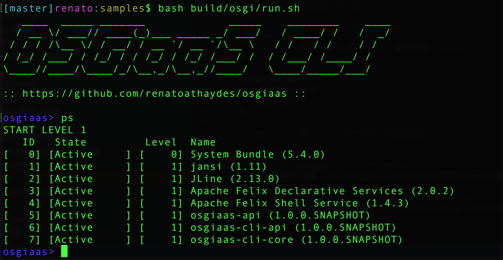
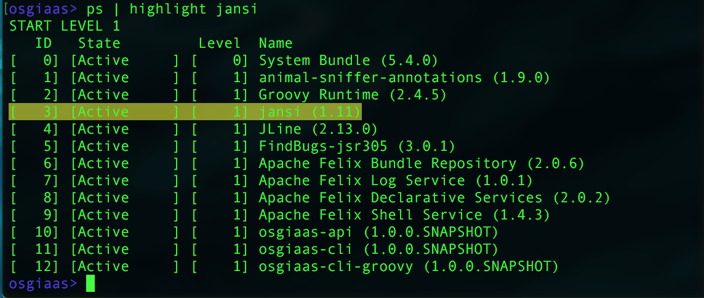

# OSGiaaS CLI

A Command Line Interface (CLI) based on on [JLine](http://jline.github.io/jline2/)
and [Apache Felix Shell](http://felix.apache.org/documentation/subprojects/apache-felix-shell.html).



## Core Commands

Besides the OSGi Commands exported by the Felix Shell bundle (which allows inspecting and
monitoring the OSGi system itself), this bundle adds the following Commands:

* `alias` - alias a command with a different name.
* `ci` - command introspection.
* `clear` - clear the CLI contents.
* `color` - set the default colors of the CLI.
* `grep` - filter lines matching a regular expression.
* `highlight` - color-highlight lines matching a regular expression.
* `lr` - list JVM resources.
* `prompt` - changes the shell prompt (to use whitespaces, quote the prompt as in `" > "`).
* `run` - run OS native programs.

> Besides the core commands, the Felix Shell Bundle itself exports a number of commands to manage the
  OSGi environment, such as `help`, `headers`, `install`, `refresh` etc.

## OSGiaaS extra command modules

> Check the [CLI modules directory](../../modules/cli) for the full list.

* [Frege](osgiaas-cli-frege.md) - Frege REPL
* [Grab](osgiaas-cli-grab.md) - Grab Maven dependencies and add them to the running system
* [Groovy](osgiaas-cli-groovy.md) - Groovy REPL
* [Ivy](osgiaas-cli-ivy.md) - Install artifacts directly from Maven repositories using Apache Ivy
* [Javac](osgiaas-cli-javac.md) - Java REPL
* [JavaScript](osgiaas-cli-js.md) - JS REPL ([Nashorn](http://openjdk.java.net/projects/nashorn/))
* [Scala](osgiaas-cli-scala.md) - Scala REPL

## Writing your own commands in Java and other JVM languages

See [Writing custom commands](writing-custom-commands.md).

## Core command details

*Highlight command:*

The highlight command highlights the input lines that match a given regular expression.
This command is often used to highlight output from other commands via the '|' (pipe) operator.



## Command details

### alias

The alias command lets you alias existing commands.

For example, if you think the `highlight` command is too long to type, you can alias it with `hl` as follows:

```
alias hl=highlight
```

Now, every time you type the `hl` command, the osgiaas-cli will replace it with the existing `highlight` command,
passing all the arguments to it.

To show all existing aliases, type:

```
alias show
```

To remove an existing alias, use `alias remove`:

```
alias remove hl
```

Notice that aliases can include arguments as well if you quote the command with the arguments:

```
alias hl="highlight -f red -b yellow"
```

### ci

Command Introspect.

This command can be used to introspect any command. It is similar to `help`, but can display more information,
including which services the command implementation provides, the name of the implementator class, and the bundle
which provides the service.

The `ci` command accepts the following options:

* -v (--verbose): show verbose output.

You can limit the commands to be introspected by providing a pattern as an argument.

For example, to see verbose information about the `ps` command, type:

```
>> ci -v ps
```

Or to see information about all commands starting with the letter `g`:

```
>> ci g.*
```

### clear

Clears the CLI contents.

It should work exactly the same as your shell's `clear` command.

### color

The color command can change the color of:

* the **prompt**
* the commands' **text** output
* the commands' **error** output
* all of the above

The color command accepts the following options:

  * [-t], [--target] <prompt|text|error|all>
  * -c, --color <reset|black|red|green|yellow|blue|purple|cyan|white>

For example, to change the prompt color to green, the text output to white, and the error output to yellow:

```
color -c green -t prompt
color -c white -t text
color -c yellow -t error
```

To change all of them at once, type just the color:

```
color -c cyan
```

For the color command to work, your shell must support ANSI formatting.

### grep

A simple implementation of the famous grep utility.

Grep filters the input it is given, showing only lines that match the given regular expression.

It is usually used with the pipe operator.

For example, to list all installed OSGi bundles (which the `ps` command does) that contain the word "cli":

```
ps | grep cli
```

To type arbitrary regular expressions, you should quote it:

```
ps | grep "\\[Active.*\\(1\\.11\\)"
```

All regular expressions are wrapped into two `.*`, so the above regular expression would be turned into
`.*\\[Active.*\\(1\\.11\\).*`. This is done to support simple search, as in `grep Active`.

The following flags are supported:

* -B (--before-context) <lines>: number of lines to print before each match.
* -A (--after-context) <lines>: number of lines to print after each match.

Which can be used like this, for example:

```
>> ps | grep -B 4 -A 2 "\\[Active.*\\(1\\.11\\)"
```

### highlight

To search for text in the output of another command, but still show all text, you can use the `highlight` command.
Just like the grep command, highlight is mostly useful when used with the pipe operator to receive input from
other commands.

ANSI formatting is used to color-highlight text in shells that support it.

For example, to highlight all lines matching a regular expression `\\[Active.*\\(1\\.11\\)`:

```
>> ps | highlight "\\[Active.*\\(1\\.11\\)"
```

The following flags are accepted:

* -b (--background-color) <color>: background color (yellow, by default)
* -f (--foreground-color) <color[+format]*>: text color and format

The accepted colors are the same as for the `color` command.

Available formats are (each item shown in the short format as well as the long format):

* `high_intensity` or `hi`
* `low_intensity` or `li`
* `italic` or `i`
* `underline` or `u`
* `blink` or `b`
* `rapid_blink` or `rb`
* `reverse_video` or `rv`
* `invisible_text` or `it`

Examples of valid invocations of the highlight command:

```
# show all available commands, highlighting all containing a 's'
>> help | highlight s

# show all installed bundles, highlighting those containing the 'osgi' word
# with a blue background and green, blinking text 
>> ps | highlight -b blue -f green+blink osgi

# show the headers of bundle with ID 10, highlighting the `Bundle-SymbolicName` entry
# with a red background and yellow, high-intensity, underlined text 
>> headers 10 | highlight -b red -f yellow+hi+u "Bundle-SymbolicName"
```

### lr

Lists JVM resources.

JVM resources are the resources included in the installed bundles and usually visible to Java code via the
[getResource(String name)](https://docs.oracle.com/javase/7/docs/api/java/lang/ClassLoader.html#getResource(java.lang.String))
method.

The resource name is always assumed to be an absolute path with `forward-slash` as a path separator.

The `lr` command supports the following options:

* -r (--recurse): recursively list resources under sub-paths.
* -a (--all): show all resources, including nested classes.
* -p (--pattern) <file-pattern>: file pattern to search.
* -v (--verbose): show verbose output, including bundle information for each resource.

For example, to list all class files available under the 'com' package:

```
>> lr -r -p *.class com/
```

### prompt

To change the prompt, simply type the prompt command followed by the new prompt.

To add spaces after a prompt, you can quote the new prompt:

```
>> prompt "renato> "
renato> |
```

### run

Run a native OS command, such as `ls` (list directory contents) or `cat` (print file) in Linux.

The `run` command simply forwards its argument to the OS and prints the output of the OS process.

For example, to list the contents of the current directory:

```
>> run ls
```

> Notice that OSGiaaS-CLI supports changing directory in the OS with `run cd <dir>`!

The following shows how you can use the `use` and `run` commands to access some OS functionality easily:

```
>> use run
< Using 'run'. Type _use to stop using it
>> ls
< dir1
  scripts
  file1.txt
>> cd scripts
< /Users/me/scripts
>> ls
< script1.py
  script2.groovy
>> cat script2.groovy
< println 'Hello World'
>> _use run
< Stopped using 'run'
```

## Command modifiers

Raw commands given by the user may be modified by OSGi services implementing the `CommandModifier` interface.

The following command modifiers, or operators, are exported by the core CLI bundle:

* `&&` - breaks up a single line into several commands.
* `|` - pipes the output of a command as the input of the next command.
* `alias` - the same as the alias Command (which is both a `Command` and a `CommandModifier`).
* `use` - use some Command (ie. avoid re-typing a command every time you want to run it)

Examples:

### && operator

```
# Run the `color blue` command, then run the `color red prompt` command:
>> color blue && color red prompt
```

### `|` operator

```
# Grep all lines matching the `osgiaas.*api` regular expression from the output of the `ps` command:
>> ps | grep "osgiaas.*api"
```

### alias

See the alias command documentation above.

### use

```
# Use the `run` command (hence making the OSGiaaS CLI behave almost like a native shell)
>> use run

# Now, any command `cmd` you type will be turned into `run $cmd`

# list directories in Linux
>> ls

# change the working directory to the `tools` directory
>> cd tools

# to run an OSGiaaS command, escape the name of the command by prefixing it with a underscore (`_`)
>> _color green prompt
```


## Command history

Command history is supported by JLine (see the JLine docs for configuring it).

Persistent history is saved on the `<user.home>/.osgiaas_cli_history` file by default.
To change the location of this file, set the `osgiaas.cli.history` System property
(with a -D option) when starting the JVM.


## Init file

If you want certain commands to be emitted every time you start the CLI, you can create a
file at `<user.home>/.osgiaas_cli_init` containing all the commands you want to run, one
in each line.

The location of this file can be configured using the `osgiaas.cli.init` System property.

Example `.osgiaas_cli_init` file:

```
prompt "? "
color red prompt
color yellow error
alias exit=shutdown
```


## Multi-line commands

To enter multi-line commands, wrap them between a `:{` and a `:}` lines.

Example:

```
>> :{
java -c class Hello {
  public static void sayHi() {
    System.out.println("Hi there");
  }
}
:}
```

