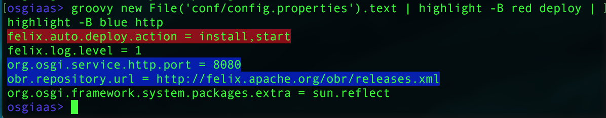
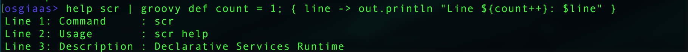

# OSGiaaS CLI Groovy Module

The OSGiaaS CLI Groovy bundle exports a command which allows users to run arbitrary Groovy
scripts from the shell, much like in the Groovy REPL.

To use the command is extremely simple. Any argument is treated as groovy code:

```
>> groovy 2 + 2
4
```

The value returned by the Groovy script is printed unless it is `null`.

## Command Options

The following options are supported:

  * -r: reset the current code statements buffer.
  * -s: show the current statements buffer.

The code statements buffer currently contains all entered import statements (so imports do not need to be
re-typed on every command).

For example:

```
>> groovy import java.util.concurrent.*
>> groovy Callable
interface java.util.concurrent.Callable
>> groovy -r # reset the buffer
>> groovy Callable
groovy.lang.MissingPropertyException: No such property: Callable for class: Script95
```

## Available bindings

Groovy scripts have access to the following variables:

* `out`: cli standard output (`println` and `out.println` are equivalent)
* `err`: cli error output (as `out`, an instance of `PrintStream`)
* `ctx`: the service's `ComponentContext` which can be used to access the OSGi framework

## Using the Groovy command in pipelines

You may pipe the output of a Groovy script into another command:



To receive data in a pipeline, the Groovy script must return a closure that takes a String.
This closure will run for each line of input received.

For example:



When using the groovy command in pipelines, as above, the closure's opening and closing braces
(`{` and `}`) may be omitted:

```groovy
ps | groovy l -> println "**** $l ****"
```

**Hint:** If you use groovy often, consider adding an alias for it:

```
alias gr="groovy it -> "
```

Now, you can run:

```groovy
ps | gr println "**** $it ****"
```

Pretty convenient.
