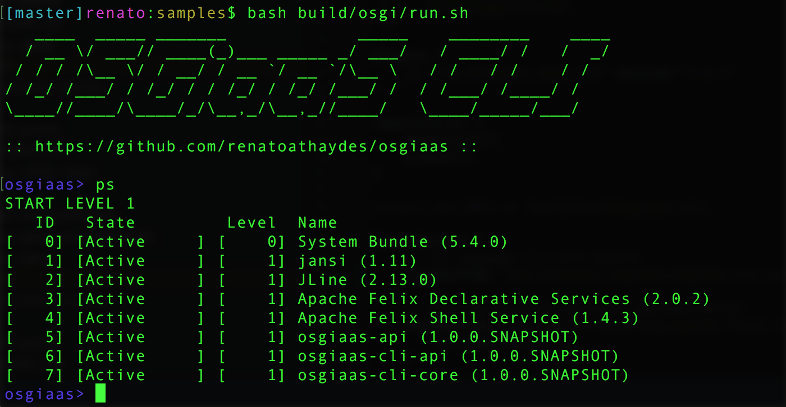

# OSGiaaS Project

The **OSGiaaS** Project aims to provide JVM modules and a CLI to make the development
of truly modular, dynamic applications easier.

Though all modules are OSGi bundles, many modules can also be used without OSGi (in standard Java applications).

Modules are distributed and assembled as an application via Gradle, with the help of the
[osgi-run](https://github.com/renatoathaydes/osgi-run) plugin.

## System requirements

The only requirements to get started is to have a (Java 8) JVM and
[Gradle](https://docs.gradle.org/current/userguide/installation.html) installed.

## Getting started

### Downloading the modules

Choose a Gradle script from one of the [samples](../samples/) files, copy the file contents into a file called `build.script`,
then run `gradle createOsgi`.

> To enable a remote debugger to be attached to the process, run `gradle -Pdebug createOsgi`.

Here's the [CLI minimal sample](../samples/osgiaas-cli-minimal.gradle)
(installing only the minimum configuration of modules necessary to run the CLI):

```groovy
plugins {
    id "com.athaydes.osgi-run" version "1.5.1"
}

repositories {
    mavenLocal()
    jcenter()
}

dependencies {
    // the osgiaas-cli core bundle
    osgiRuntime 'com.athaydes.osgiaas:osgiaas-cli-core:0.5'

    // OSGi Service Component Runtime implementation
    osgiRuntime 'org.apache.felix:org.apache.felix.scr:2.0.2', {
        exclude group: '*'
    }
}

runOsgi {
    bundles = [ ] // all bundles added as osgiRuntime dependencies
}
```

To install all OSGiaaS commands, use the [osgiaas-cli-all.gradle](../samples/osgiaas-cli-all.gradle) file instead.

### Run

Run the system by running the appropriate OS script generated in the (by default) `build/osgi/` directory
(eg. `run.sh` or `run.bat`).

You can then type `ps` to show all bundles installed in the system.

You should then see something similar to this:



## Modules

Modules are grouped together into the following broad categories:

* [cli](cli): the OSGiaaS CLI (command-line interface) sub-project.
* [lang](lang): language services, such as a Java compiler service.
* [infra](infra): infrastructure modules providing functionality such as auto-update, logging etc.

All modules can be found under the [modules](../modules) directory.

### OSGiaaS CLI

The OSGiaaS CLI project is a command-line interface that allows users to run commands written in Java or in
any other JVM language (Groovy, Kotlin, Ceylon, Frege), as well as native programs.

So you don't need to write scripts in bash or other inferior language anymore. Write the script in your favourite
JVM language, with all the advantages that entails (eg. IDE support, debugging...).

Some commands are JVM language interpreters, so the OSGiaaS CLI can be used as a polyglot REPL.

Most CLI functionality is built on top of the modules in the other categories.

Native OS programs can also be run with the `run` command, making the OSGiaaS CLI a really great addition
to your favourite shell.

**List of CLI modules**:

* Core (CLI implementation as well as core commands)
* Frege (Haskell/Frege interpreter)
* Grab (grab and use a dependency from any repository)
* Groovy (Groovy interpreter)
* Javac (Java interpreter)
* JS (JavaScript interpreter)

### Language modules

Modules that help to write or **interpret** code at runtime.

> In reality, as all code runs in the JVM, the code is first compiled to bytecode, then run, but that happens
  so fast that it looks and feels like an interpreter.

The `osgiaas-javac` module, for example, adds support for compiling and running arbitrary Java code.

**List of language modules**:

* Autocomplete (a text auto-complete API and simple implementation)
* Java-autocomplete (Java-specific auto-complete functionality)
* Javac (compile Java code at runtime)

> Many languages, such as JavaScript and Groovy, are supported out-of-the-box (via Nashorn and the Groovy bundle,
respectively) so they don't need a OSGiaaS language module.

### Infrastructure modules

Infrastructure modules add support for a number of useful facilities for applications.

**List of infrastructure modules**:

* Auto-update (OSGi bundle auto-updater config and API)
* Grab (Grab and wrap any jar dependency into an OSGi bundle)
* Auto-update-Grabber (Auto-update implementation based on the Grab module)
* SLF4J Implementation (allows using the SLF4J Logging API for logging within OSGi bundles)
