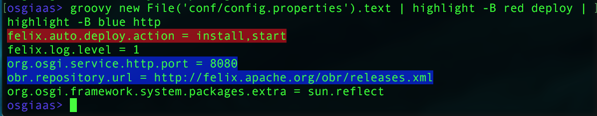
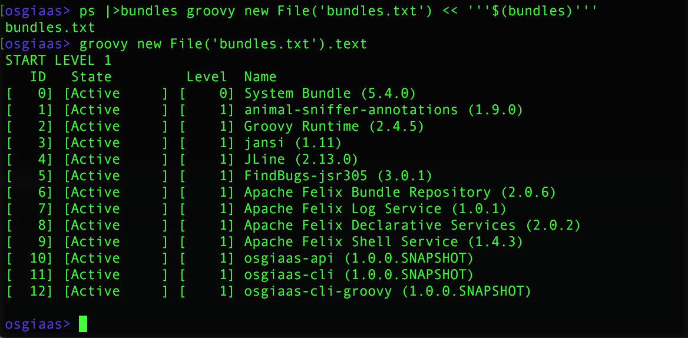

# OSGiaaS CLI Groovy extension

The OSGiaaS CLI Groovy extension bundle exports a command which allows users to run arbitrary Groovy
scripts from the shell.

To use the command is extremely simple. Any argument is treated as groovy code:

```
groovy 2 + 2
```

The above prints `4`.

The value returned by the Groovy script is printed unless it is `null`.

## Using the Groovy command in pipelines

You may pipe the output of a Groovy script into another command:



To receive data in a pipeline, the Groovy script must return a closure that takes a String.
This closure will run for each line of input received.

For example:



When using the groovy command in pipelines, as above, the closure `{` and `}` may be omitted:

```groovy
ps | groovy l -> println "**** $l ****"
```

